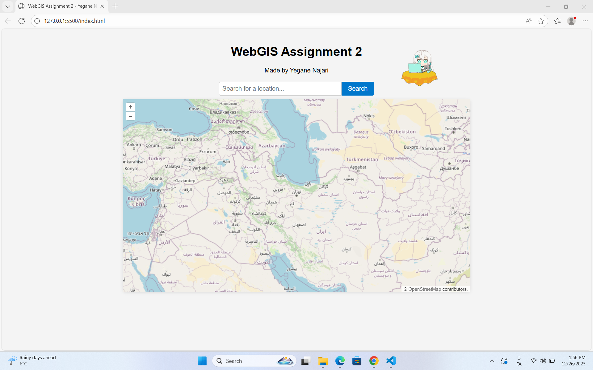
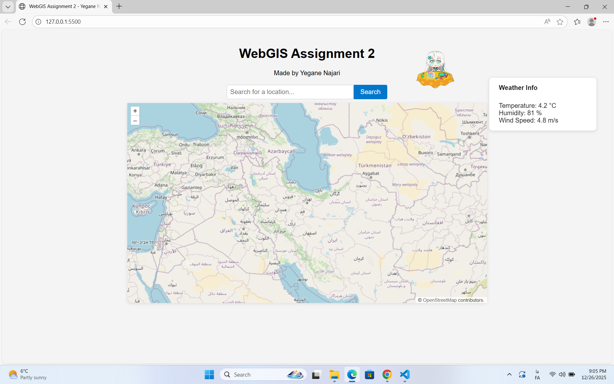

# WebGIS Course – Assignment 2
**Interactive Web Mapping with OpenLayers, Geocoding, and Weather APIs**

## Project Overview
This project is developed as part of *WebGIS Course – Assignment 2*.  
The goal of the assignment is to build an interactive web map using **OpenLayers**, integrate **external APIs** for geocoding and weather data, and work with **asynchronous JavaScript (Fetch API)**.

The application allows users to:
- Search for a location and zoom to it on the map
- Click anywhere on the map to retrieve and display real-time weather information

---

## Technologies Used
- **OpenLayers** – interactive web mapping
- **HTML5 / CSS3**
- **JavaScript (ES6)** with async/await
- **Fetch API** for HTTP requests
- **Nominatim (OpenStreetMap)** – Geocoding
- **Open-Meteo** – Weather data

---

## Project Structure
├── index.html # Main HTML file
├── style.css # Styling for map and UI
├── script.js # OpenLayers initialization and API logic
├── search.png # Screenshot of geocoding functionality
├── weather.png # Screenshot of weather display
└── README.md # Project documentation

---

## OpenLayers Features Used

### 1. Map and Layers
- **Base Layer**: OpenStreetMap (OSM)
- **Layer Type**: Tile Layer
- **Source**: `ol.source.OSM()`

### 2. View Configuration
- Initial center set to Tehran (EPSG:3857)
- Zoom level adjusted dynamically
- Smooth animation when zooming to searched locations

### 3. Controls and Interactions
- Zoom controls (+ / –)
- Map panning (drag interaction)
- Click interaction to retrieve weather data

### 4. Animations
- `map.getView().animate()` is used to smoothly zoom and pan to searched locations.

---

## Part 1 – Geocoding Search

### Implemented Features
- Search input field with button
- Fetch request to geocoding API
- Convert latitude/longitude to map projection
- Animate map to searched location
- Error handling for invalid locations

### Geocoding API Used
**Nominatim (OpenStreetMap)**  
- No API key required
- Free and open-source
- Widely used for educational and research purposes

---

## Part 2 – Weather Data Display

### Implemented Features
- Map click event listener
- Extract latitude and longitude from clicked point
- Fetch real-time weather data
- Display weather information in a floating info box

### Weather API Used
**Open-Meteo**
- No API key required
- Free for non-commercial and educational use
- Provides real-time and forecast weather data

Displayed Weather Information:
- Temperature (°C)
- Relative Humidity (%)
- Wind Speed (m/s)

---

## API Comparison and Pricing Analysis

### Geocoding APIs Comparison

| API | Free Tier | Rate Limits | API Key Required | Notes |
|----|-----------|-------------|------------------|------|
| Nominatim (OSM) | Unlimited (fair use) | Usage-based | No | Open-source, ideal for education |
| MapQuest | Limited | Yes | Yes | Requires registration |
| Google Geocoding API | Limited | Strict | Yes | Paid after free quota |

**Chosen API:** Nominatim  
**Reason:** No API key required, open-source, suitable for academic projects.

---

### Weather APIs Comparison

| API | Free Tier | Rate Limits | API Key Required | Notes |
|----|-----------|-------------|------------------|------|
| Open-Meteo | Unlimited | Fair use | No | Clean API, easy integration |
| OpenWeatherMap | Limited | Yes | Yes | Requires account & key |
| WeatherAPI.com | Limited | Yes | Yes | Paid plans after quota |

**Chosen API:** Open-Meteo  
**Reason:** No API key, reliable data, and simple JSON structure.

---

## Screenshots

### Geocoding Search

### Weather Information on Map Click

---

## Error Handling
- User input validation for empty searches
- Graceful handling of failed API responses
- User-friendly alert messages

---

## Setup Instructions
1. Clone or download the repository
2. Open the project folder in **VS Code**
3. Use **Live Server** to run `index.html`
4. No API keys are required

---

## Conclusion
This project demonstrates how modern web mapping applications can be built using OpenLayers and external APIs.  
By integrating geocoding and weather services, the application provides an interactive and informative user experience without relying on paid or restricted APIs.

---

## Author
**Yegane Najjari**  
WebGIS Course – Assignment 2

